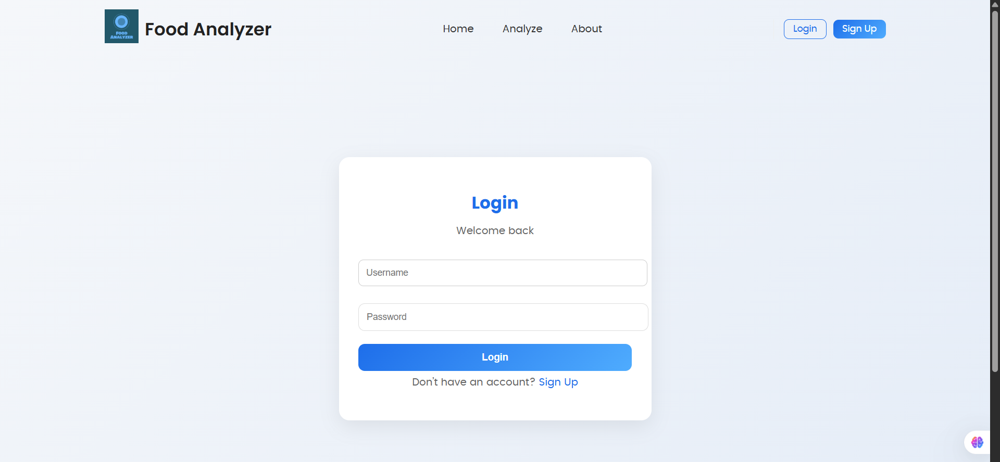
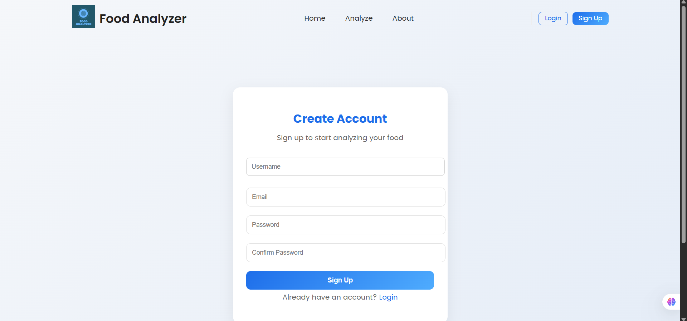
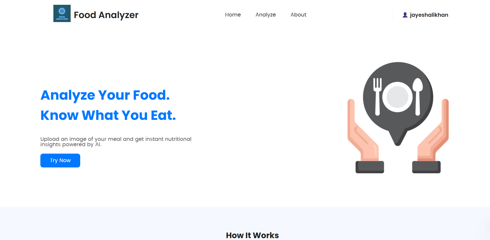
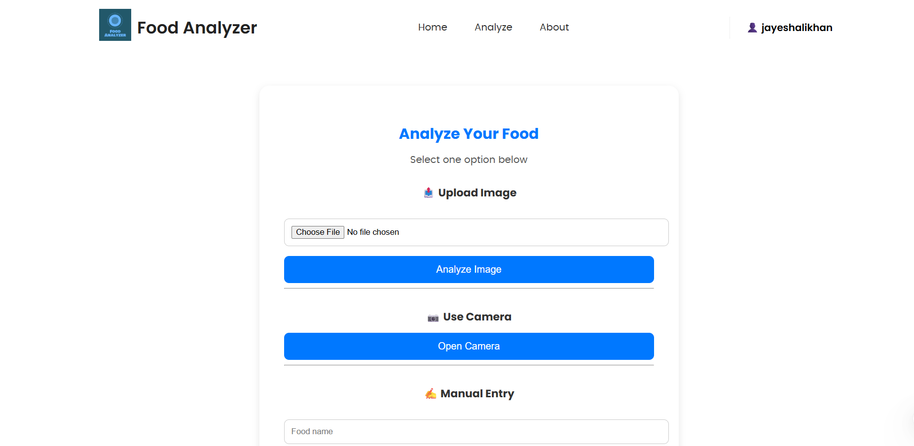
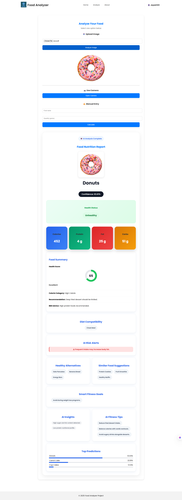
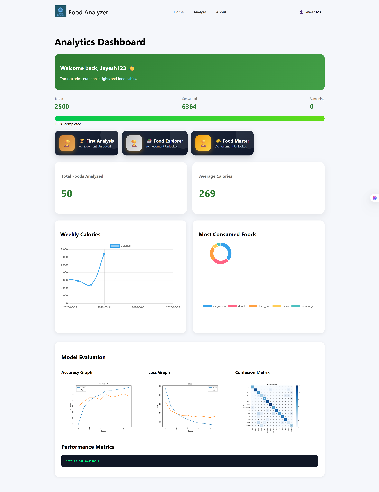
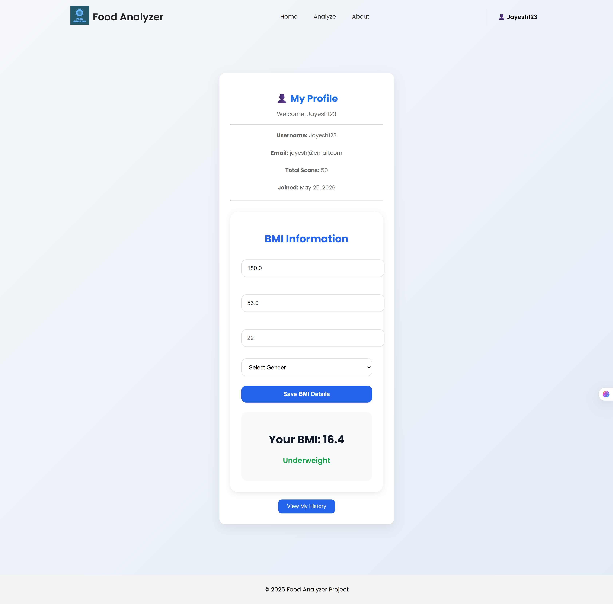
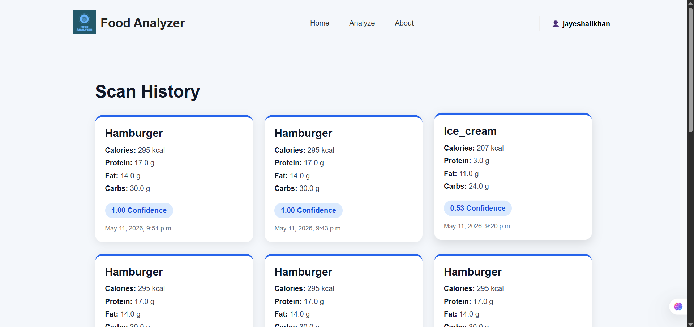

# 🍎 AI Food Analyzer

An intelligent food recognition and nutrition analysis web application built using **Django**, **TensorFlow**, and **MobileNetV2**. The system identifies food items from images, estimates nutritional values, provides personalized health insights, and tracks user food consumption through an interactive dashboard.

---

## 📌 Project Overview

AI Food Analyzer is designed to help users make healthier dietary decisions by automatically analyzing food images and providing detailed nutritional information.

The application combines deep learning based food classification with nutrition intelligence to deliver:

- Food image recognition
- Calorie estimation
- Macronutrient analysis
- BMI-based recommendations
- Personalized food insights
- Consumption history tracking
- Analytics dashboard
- Achievement badge system

---

## 🚀 Key Features

### 🖼 Food Image Recognition

- Upload food images
- Camera-based food capture
- AI-powered classification using MobileNetV2

### 🥗 Nutrition Analysis

- Calories
- Protein
- Fat
- Carbohydrates

### ❤️ Health Intelligence

- Health score calculation
- Health label generation
- BMI-based recommendations
- Risk alerts
- Personalized nutrition suggestions

### 📊 Analytics Dashboard

- Daily calorie tracking
- Weekly calorie trends
- Most consumed foods
- Average calorie consumption
- Food consumption history

### 🏆 Gamification

- First Analysis Badge
- Food Explorer Badge
- Food Master Badge
- Food Champion Badge

### ✍ Manual Food Entry

- Calculate nutrition manually
- Instant calorie estimation
- Nutrition summary generation

---

## 🏗 System Architecture

User Image Upload / Camera Capture
↓
Image Preprocessing
↓
MobileNetV2 CNN Model
↓
Food Classification
↓
Nutrition Dataset Lookup
↓
Health Analysis Engine
↓
Dashboard & Recommendations

---

## 🛠 Technology Stack

### Frontend

- HTML5
- CSS3
- JavaScript
- Chart.js

### Backend

- Django
- Python

### AI / Machine Learning

- TensorFlow
- Keras
- MobileNetV2

### Database

- SQLite

### Data Processing

- NumPy
- Pandas

---

## 📂 Dataset

### Food-101 Dataset

- 101 Food Categories
- 101,000 Images
- High-quality food image dataset

### Custom Nutrition Dataset

Contains:

- Calories
- Protein
- Fat
- Carbohydrates
- Health labels
- Recommendations
- Risk alerts
- Similar foods

---

## ⚙ Installation

### Clone Repository

```bash
git clone https://github.com/SurajGirase8210/food-analyzer.git
cd food-analyzer
```

### Create Virtual Environment

```bash
python -m venv venv
```

### Activate Environment

Windows:

```bash
venv\Scripts\activate
```

Linux/Mac:

```bash
source venv/bin/activate
```

### Install Dependencies

```bash
pip install -r requirements.txt
```

### Run Migrations

```bash
python manage.py migrate
```

### Start Server

```bash
python manage.py runserver
```

Open:

```text
http://127.0.0.1:8000
```

---

## 📈 Dashboard Features

The dashboard provides:

- Daily calorie intake
- Weekly calorie analytics
- Food distribution charts
- Achievement badges
- Average calorie statistics
- Model evaluation metrics

---

## 🧠 Machine Learning Model

### Model Used

MobileNetV2

### Why MobileNetV2?

- Lightweight architecture
- Faster inference
- High classification accuracy
- Suitable for web deployment

### Output

The model predicts:

- Food Name
- Confidence Score
- Top Predictions

---

## 📷 Application Screens

- Login Page
  

- Registration Page
  

- Home Page
  

- Food Analysis Page
  

- AI Result Page
  

- Dashboard Page
  

- Profile Page
    

- Food History Page
  

---

## 🎯 Future Enhancements

- Real-time food detection
- Portion size estimation
- Multi-food recognition
- Barcode scanning
- Mobile application
- Cloud deployment
- Personalized diet planning
- Voice assistant integration

---

## 📚 Learning Outcomes

This project demonstrates:

- Deep Learning
- Computer Vision
- Django Development
- Full Stack Development
- Data Visualization
- Nutrition Analytics
- User Authentication
- Dashboard Design

---

## 👨‍💻 Author

SurajSingh Dhiraj Jayesh Ninad Raj

Final Year Engineering Project

AI Food Analyzer using Deep Learning and Django

---

## 📄 License

This project is developed for educational and academic purposes.
